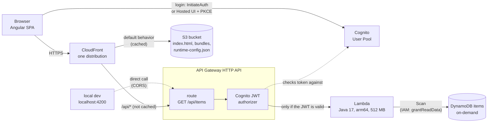

# Angular + AWS Lambda + DynamoDB + AWS CDK Sample (Lambda+DynamoDB+API Gateway+no VPC)

<!-- contents -->
**Contents**

- [Implemented cloud concepts](#implemented-cloud-concepts)
- [Theoretical background](#theoretical-background)
  - [Cloud platforms](#cloud-platforms)
  - [Infrastructure as Code (IaC)](#infrastructure-as-code-iac)
- [Architecture](#architecture)
  - [Why use CDK (Infrastructure as Code)?](#why-use-cdk-infrastructure-as-code)
  - [Identity & authentication (Cognito)](#identity--authentication-cognito)
  - [Serverless compute (Lambda)](#serverless-compute-lambda)
  - [CORS: needed locally, not in production](#cors-needed-locally-not-in-production)
  - [Why Lambda + DynamoDB, and what's actually different from the AWS-Fargate-App sample](#why-lambda--dynamodb-and-whats-actually-different-from-the-aws-fargate-app-sample)
  - [Why not Spring Boot on Lambda](#why-not-spring-boot-on-lambda)
  - [DynamoDB and scalability](#dynamodb-and-scalability)
  - [Object storage (S3)](#object-storage-s3)
- [CDK Bootstrap](#cdk-bootstrap)
  - ["Compiling" the deployment infrastructure](#compiling-the-deployment-infrastructure)
- [Prerequisites](#prerequisites)
  - [AWS credentials](#aws-credentials)
- [Build the Lambda jar](#build-the-lambda-jar)
- [First-time setup: deploy Cognito, DynamoDB, and the backend](#first-time-setup-deploy-cognito-dynamodb-and-the-backend)
  - [Create a demo user](#create-a-demo-user)
- [Local development](#local-development)
  - [Why there's no `docker-samples/`-style all-in-one local stack here](#why-theres-no-docker-samples-style-all-in-one-local-stack-here)
- [Full deploy](#full-deploy)
  - [Wire up the Hosted UI callback for the deployed site](#wire-up-the-hosted-ui-callback-for-the-deployed-site)
- [End-to-end smoke test](#end-to-end-smoke-test)
- [Automated E2E tests (Playwright)](#automated-e2e-tests-playwright)
- [Tear down](#tear-down)
- [Troubleshooting](#troubleshooting)
- [Further reading](#further-reading)
<!-- /contents -->

## Implemented cloud concepts

- **S3** — both `FrontendStack`s (`siteBucket`, blocked public access + OAC)
- **CDN/Edge caching** — CloudFront in both, with S3 + backend (ALB vs HTTP API) as dual origins, `CACHING_OPTIMIZED` vs `CACHING_DISABLED`
- **Lambda** — `AWS-Lambda-App/infra/lib/backend-stack.ts` (Java 17, ARM_64/Graviton)
- **EC2 / Fargate contrast** — `AWS-Fargate-App`'s `ApplicationLoadBalancedFargateService` (Fargate, no EC2 management) vs this project's zero-server model
- **RDS** — `AWS-Fargate-App`'s `DataStack` (Postgres, isolated subnet, Secrets Manager-generated creds)
- **DynamoDB** — this repo's `DataStack` (PAY_PER_REQUEST, no VPC needed — fully managed over public API)
- **VPC** — `AWS-Fargate-App` only (public+isolated subnets, no NAT); this app has none, illustrating that DynamoDB doesn't need a VPC
- **ALB** — `AWS-Fargate-App` (`ApplicationLoadBalancedFargateService`)
- **API Gateway** — this repo (`HttpApi` + Cognito JWT authorizer at the gateway, contrasted against the Fargate app's in-app `SecurityConfig` check)
- **IAM / Zero-Trust identity** — Cognito User Pools + JWT auth in both; scoped grants (`grantReadData`, custom-resource policy) here
- **Secrets Management** — `AWS-Fargate-App` (`ecs.Secret.fromSecretsManager` for DB creds)
- **Custom silicon (Graviton)** — both: `Architecture.ARM_64` Lambda here, `BURSTABLE4_GRAVITON` RDS instance there
- **CDK as IaC** (imperative, TS, compiles to CloudFormation) — the entire `infra/` of both

A minimal reference system with exactly two features: **login** and a **read-only items list** pulled from DynamoDB.
This is the serverless sibling of `AWS-Sample-App` (Fargate + RDS Postgres) — same product, same frontend, deliberately different backend architecture so the two can be compared directly.

## Theoretical background

### Cloud platforms

- **AWS** (~31% market share)
  - Deepest service catalog and largest ecosystem.
  - First-mover advantage in serverless (Lambda, DynamoDB).
  - Strong custom silicon (Graviton CPUs) for a cost-performance edge.
- **Microsoft Azure** (~23–25% share)
  - Easy integration with widely-used Microsoft corporate solutions (Active Directory, M365 accounts/passwords/permissions).
  - Dominant in hybrid cloud via Azure Arc (connect and manage your own servers from Azure's control panel).
  - First-party OpenAI integration and the Copilot ecosystem (using AI models at scale within company privacy boundaries).
- **Google Cloud (GCP)** (~11–12% share)
  - Best-in-class managed Kubernetes (Google's own technology — zero-management, no VM instances, pay-by-usage if you containerize this way).
  - Superior big data / real-time analytics (BigQuery — SQL queries over enormous datasets in seconds).
  - Advanced AI infrastructure (Vertex AI, custom TPUs).

This project uses AWS.
The choice of Cognito/DynamoDB/Lambda/API Gateway/S3+CloudFront throughout reflects AWS-specific services, not a cloud-agnostic design.
Specifically Lambda/DynamoDB rather than the sibling project's Fargate/RDS, per the comparison below.

### Infrastructure as Code (IaC)

The general shift this project follows: from manual web-console clicking to version-controlled software practices for defining infrastructure.

|                 | Multi-cloud / ecosystem | Cloud-native |
|-----------------|--------------------------|---------------|
| **Declarative** (DSL) | Terraform (HCL) | CloudFormation (YAML/JSON) |
| **Programming languages** (imperative) | Pulumi (TS, Python, Go) | **AWS CDK** (TS, Python, Java, ... — compiles to CloudFormation) |

> [!NOTE]
> This project sits in the bottom-right cell: AWS CDK, cloud-native and imperative.
> See "Why use CDK" below for what that trade-off actually buys you.

#### How IaC tools actually deploy

None of the three tools compiles to anything that runs inside the cloud.
Each one works out the list of resources you want and then has the cloud's API create them.
The difference is *who* makes those API calls:

- **Terraform / Pulumi** (client-side): your machine calls each service API directly (`s3:CreateBucket`, `ecs:CreateService`, ...) and tracks the result in a state file.
- **AWS CDK** (server-side): `cdk synth` produces a CloudFormation template (`infra/cdk.out/`), and `cdk deploy` uploads it and calls only the CloudFormation API.
  - The CloudFormation service then calls the individual service APIs from inside AWS, keeps the state in the stack, and rolls back automatically on failure.

#### What "multi-cloud" actually means

> [!WARNING]
> "Multi-cloud" means one tool and one workflow with many providers.
> It does not mean one piece of code that runs on every cloud.
> A provider is a plugin that knows one cloud's API, and resources stay cloud-specific (Terraform's `aws_s3_bucket` vs `google_storage_bucket`).

#### Is there a universal, Liquibase-style layer?

Mostly no, and the reason is useful to know.
Liquibase works because SQL databases share one concept (tables, columns, indexes), so `createTable` can be translated into each dialect (database engine).
Cloud services don't line up like that.
AWS IAM and GCP IAM work differently, and so do VPCs, and Fargate vs. Cloud Run vs. Azure Container Apps.
The closest portable layers are Kubernetes (portable runtime), Crossplane or your own modules (one interface over per-cloud implementations), and Dapr (app-level APIs). Each one costs you some cloud-specific features.

## Architecture



The browser talks to two places only: **Cognito**, to log in and get a JWT, and **CloudFront**, for everything else.
CloudFront serves the Angular files from S3 and forwards `/api/*` to API Gateway, so the frontend and the API share one origin and no CORS is needed in production.
**API Gateway's JWT authorizer** checks the token before anything runs. An invalid token gets a `401` from the gateway, and the Lambda is never invoked, so `ItemsHandler` has no auth code at all.

There is no VPC. Lambda and DynamoDB are both managed services reached over AWS's public APIs, and access is controlled by IAM (the function's role can only read the `items` table) rather than by network placement.
The dashed line is local dev: `npm start` calls the deployed API Gateway directly, which is why the HTTP API allows CORS from `http://localhost:4200`.

| Stack | Main resources | What it does here |
|---|---|---|
| **LambdaAuthStack** | Cognito User Pool, app client, Hosted UI domain `items-lambda-app` | Users, login flows, issuing JWTs. Self-signup is off. |
| **LambdaDataStack** | DynamoDB table `items` (partition key `id`, on-demand billing), `AwsCustomResource` seed | Stores the items. The 8 seed rows are written once, when the stack is created. |
| **LambdaBackendStack** | Lambda function (pre-built `items-lambda.jar`), HTTP API with one route, `HttpUserPoolAuthorizer` | Validates the JWT at the gateway, invokes the Lambda, allows CORS for local dev only. |
| **LambdaFrontendStack** | Private S3 bucket (OAC), CloudFront distribution, 3 `BucketDeployment`s | Hosts the SPA, routes `/api/*` to the HTTP API, rewrites 403/404 to `index.html`, writes `runtime-config.json` from live CDK values. |

**Code layout:**

- **infra/** — AWS CDK (TypeScript), 4 stacks: `LambdaAuthStack` (Cognito), `LambdaDataStack` (DynamoDB table), `LambdaBackendStack` (Lambda behind an HTTP API), `LambdaFrontendStack` (S3 + CloudFront).
- **backend/** — a single Java 17 Lambda function (no Spring Boot — see "Why no Spring Boot" below).
  - One route: `GET /api/items`, authorized by API Gateway's built-in Cognito JWT authorizer.
- **frontend/** — Angular 18 (standalone components), **identical** to the AWS-Fargate-App sample's frontend except for the API-Gateway-specific comments — same two login paths, same auth guard, same items page.
  - It doesn't know or care that the backend changed.

No signup UI exists on purpose — create a demo user manually (below).

### Why use CDK (Infrastructure as Code)?

> [!TIP]
> Rather than clicking through the AWS Console, this project's infrastructure is defined as TypeScript code (`infra/`).
> That gets you:
>
> - Standard programming constructs — loops, conditionals, variables, functions, unit tests, and shareable packages — applied to infrastructure, instead of hand-repeating console steps or fighting a templating language.
> - A reproducible environment:
>   - The same code deploys an identical stack every time.
>   - A bad manual click in the Console (or a bad deploy) is undone by just deploying the previous, known-good code again.

### Identity & authentication (Cognito)

`LambdaAuthStack` uses Amazon Cognito for identity: sign-up/login, social/OAuth-OIDC logins, and JWT token issuance, so this project doesn't build a custom user-auth backend from scratch.
Cognito provides the secure user database, token generation, and multi-step auth flows.
But it doesn't remove the two integration responsibilities either side of it still has:

- The frontend must still follow the actual login procedure (this project's two paths: direct `InitiateAuth` calls, or the Hosted UI's Authorization Code + PKCE redirect).
- Something must still validate every incoming token — here, that's API Gateway's built-in `HttpUserPoolAuthorizer`, checked *before* the Lambda ever runs, unlike the AWS-Fargate-App sample where a custom `JwtDecoder` inside the Spring Boot app does it.

### Serverless compute (Lambda)

Lambda is suited to event-driven APIs, microservices, background task processors, or file pipelines — workloads shaped around discrete triggers rather than a continuously-running process.

- Pay only as used, with instant scale-to-zero and millisecond-level billing.
- Effectively unlimited, zero-management horizontal auto-scaling — no capacity to plan for.
- Native event-driven execution — the platform invokes your code in response to a trigger (an HTTP request here, but equally an S3 upload, a queue message, a schedule).

> [!NOTE]
> This is the opposite of a traditional fixed-cost, always-on server.
> No custom load balancing or VM fleet to manage in order to scale, and no custom background polling loop needed to catch events.

**Where Lambda sits in the broader compute-tier landscape:** the ECS+EC2 / ECS+Fargate comparison in the AWS-Fargate-App sample's README splits *orchestration* (ECS) from *compute* (EC2 or Fargate) as two separate layers.
A different tier skips that split entirely — fully managed, high-level services with no separate orchestration layer to configure:

- **AWS App Runner** (PaaS) — zero orchestrator setup; deploy from a Git repository or a Docker image in ECR; suited to web apps, REST APIs, and microservices.
- **AWS Lambda** — can also deploy from a Docker container image in ECR, not just a zip; suited to event-driven APIs, background data processing, or ML model inference jobs.

> [!NOTE]
> This project uses Lambda from this fully-managed tier, in contrast to the AWS-Fargate-App sample's ECS+Fargate choice from the orchestration+compute tier.

### CORS: needed locally, not in production

> [!TIP]
> - **Production**: CloudFront fronts both the frontend (S3) and backend (`/api/*` routed to the HTTP API) as behaviors on one distribution (`frontend-stack.ts`) — to the browser it's a single origin, so no CORS preflight ever happens.
> - **Local dev**: there's no local Lambda/API Gateway emulator (see the comparison table below), so local frontend dev calls the *real, deployed* HTTP API directly from `localhost:4200` — genuinely cross-origin. `backend-stack.ts`'s `HttpApi` therefore always configures `corsPreflight` for `http://localhost:4200`, even though production traffic never uses it.

### Why Lambda + DynamoDB, and what's actually different from the AWS-Fargate-App sample

The frontend and the Cognito setup are unchanged.
What changed is everything to do with running the backend and storing data:

| | AWS-Fargate-App sample | This sample |
|---|---|---|
| Compute | Long-running Spring Boot process on ECS Fargate | Java Lambda, invoked per-request by API Gateway |
| Data store | RDS Postgres (fixed hourly cost, always on) | DynamoDB, on-demand billing (near-zero cost idle) |
| JWT validation | Spring Security `SecurityConfig` + a custom `CognitoClientIdValidator`, inside the app | API Gateway's `HttpUserPoolAuthorizer`, before the Lambda ever runs |
| Schema/seed data | Flyway migrations (`V1__create_items_table.sql`, `V2__seed_items.sql`) | A CDK `AwsCustomResource` that seeds the table once on stack creation — DynamoDB has no migration tool equivalent to Flyway |
| Local dev of the backend | `mvn spring-boot:run` — a real local server you can hit, breakpoint, and iterate on in seconds | **No local emulator.** The backend must be deployed to be tested at all; local frontend dev talks to the real, deployed API Gateway |
| Framework | Spring Boot (fast to write, adds classpath scanning + context startup cost) | Plain `RequestHandler` + AWS SDK v2 (more boilerplate, no Spring cold-start tax) |

The "no local emulator" row is the headline tradeoff this sample exists to surface — every code change to `ItemsHandler.java` requires `mvn package` + `cdk deploy LambdaBackendStack` before it's testable, versus the AWS-Fargate-App sample's instant local restart.
(Tools like SAM CLI or LocalStack can close this gap; this sample deliberately doesn't reach for them, to keep the friction visible.)

### Why not Spring Boot on Lambda

> [!WARNING]
> `aws-serverless-java-container` lets you run an unmodified Spring Boot app on Lambda, but Spring's classpath scanning and `ApplicationContext` startup add hundreds of milliseconds to every cold start — exactly the cost this sample is meant to make visible, not hide.
> A plain `RequestHandler<APIGatewayV2HTTPEvent, APIGatewayV2HTTPResponse>` with the DynamoDB SDK client held in a static field (reused across warm invocations) is the idiomatic lightweight shape for a Java Lambda.
> `Runtime.JAVA_17` + `Architecture.ARM_64` (Graviton) is the current recommended combination for cost and cold-start time.

### DynamoDB and scalability

`LambdaDataStack` provisions DynamoDB — a distributed, low-latency NoSQL key-value/document store built for massive scale, in contrast to the AWS-Fargate-App sample's RDS Postgres.

- RDS requires a fixed instance size (e.g. 4 vCPU / 16 GB RAM / a fixed disk), and all writes go to one main instance — it doesn't scale horizontally.
- DynamoDB matches Lambda's scaling model 1:1: no servers or instances to size, pay strictly per read/write request, auto-scaling built in.
- Easy restore to a last-known-good state.
- Storage auto-scales.
- High availability via multiple replicas.
- Multiple database engines can front the same API/commands.

> [!IMPORTANT]
> All of this is extremely difficult to achieve with "classical" (relational, single-primary) database providers — which is exactly why RDS Postgres has no real equivalent to point to here, and why this sample pairs Lambda with DynamoDB rather than RDS.

### Object storage (S3)

`LambdaFrontendStack` uses S3 (Simple Storage Service) to host the built Angular app, exactly as the AWS-Fargate-App sample does: unstructured data storage — here, static website files — accessible over an HTTP API.
Buckets provide virtually infinite scalability and extreme durability (typically 99.999999999%, "11 nines") by replicating objects across multiple facilities automatically.
S3 never serves traffic directly here either — CloudFront sits in front of it as the actual public entry point.

## CDK Bootstrap

`cdk bootstrap` sets up the initial deployment infrastructure — a `CDKToolkit` CloudFormation stack (an S3 bucket for assets, an ECR repo, IAM roles).
It's the small, one-time piece of AWS infrastructure CDK itself needs in order to deploy the rest of your desired infrastructure.

> [!WARNING]
> **Never delete `CDKToolkit` intentionally:**
> - **S3 bucket takeover risk**
>   - If you delete its asset bucket, an attacker who knows your account ID and region could register that exact bucket name in their own account.
>   - If you later run `cdk deploy` without re-bootstrapping, your pipeline could try to publish deployment assets (e.g. Lambda code) straight into the attacker's bucket.
> - **Loss of asset history**
>   - That bucket holds zipped versions of previously deployed Lambda functions and CloudFormation templates.
>   - Deleting it wipes out that history, making rollback or inspecting older builds harder.
>
> For production, protect it with `cdk bootstrap --termination-protection`.

### "Compiling" the deployment infrastructure

- `cdk synth` — runs your TypeScript through `ts-node` (so real TypeScript type errors do get caught here) and turns the CDK constructs into raw CloudFormation JSON.
  - This is the closest thing to "compile." No AWS calls.
- `cdk diff` — also synthesizes, then asks CloudFormation to compute a change set against what's currently deployed.
  - This *does* talk to AWS, so it catches more (e.g. schema-level template validation).

> [!WARNING]
> Neither one guarantees a successful deploy. AWS-side limits aren't coverable by CloudFormation's template schema, and only surface at actual deploy time:
> - Reserved words / naming rules
> - One-resource-per-parent constraints
> - Account/region quotas
> - Region-specific service or instance-type availability
> - IAM permission boundaries
>
> Nor do they guarantee your *application's* runtime behavior is correct — that's invisible to CDK at every stage, since it lives inside the running code, not the infrastructure.
> Both categories are only knowable by deploying and exercising the running system for real.

## Prerequisites

> [!NOTE]
> Node 20+, npm, JDK 17, Maven, an AWS account + credentials configured.
> **No Docker Desktop needed** (no container images to build — contrast with the AWS-Fargate-App sample).
> The AWS CDK CLI does not need to be installed globally — `infra/package.json` scripts run it via `npx`.

### AWS credentials

Reuse the same profile as the AWS-Fargate-App sample if you have one, or create a fresh one.

If you don't already have an IAM user to deploy with, create one and generate an access key:

```bash
aws iam create-user --user-name aws-sample-app-deployer
aws iam attach-user-policy --user-name aws-sample-app-deployer --policy-arn arn:aws:iam::aws:policy/AdministratorAccess
aws iam create-access-key --user-name aws-sample-app-deployer
```

> [!WARNING]
> `AdministratorAccess` is the simplest policy that lets CDK deploy everything, but it gives this user full control of the
> account. Use it only in a personal sandbox account, and delete the access key (or the user) when you're done.

> [!IMPORTANT]
> The last command prints an `AccessKeyId`/`SecretAccessKey` pair exactly once — copy both immediately.

Then configure a named CLI profile with them:

```bash
aws configure --profile aws-app-sample
# AWS Access Key ID [None]: <paste it>
# AWS Secret Access Key [None]: <paste it>
# Default region name [None]: eu-central-1
# Default output format [None]: json
```

```bash
export AWS_PROFILE=aws-app-sample        # bash
$env:AWS_PROFILE = "aws-app-sample"      # PowerShell
```

> [!NOTE]
> **Stack names are prefixed `Lambda*`** (`LambdaAuthStack`, `LambdaDataStack`, `LambdaBackendStack`, `LambdaFrontendStack`) specifically so this app can be deployed into the *same* AWS account/region as the AWS-Fargate-App sample without colliding — CloudFormation identifies stacks by name within an account+region, not by which folder synthesized them.

## Build the Lambda jar

Unlike the AWS-Fargate-App sample (which builds its container image from source during `cdk deploy`), `LambdaBackendStack` references a pre-built jar directly.
Build it before deploying or redeploying that stack:

```bash
cd backend
mvn package
```

This produces `backend/target/items-lambda.jar` (the shaded/fat jar `infra/lib/backend-stack.ts` points at).

## First-time setup: deploy Cognito, DynamoDB, and the backend

```bash
cd infra
npm install
npx cdk bootstrap                       # once per AWS account/region
npx cdk deploy LambdaAuthStack
npx cdk deploy LambdaDataStack
npx cdk deploy LambdaBackendStack       # needs backend/target/items-lambda.jar built first
```

Note `LambdaAuthStack`'s `UserPoolId`/`UserPoolClientId`/`CognitoDomain`/`IssuerUri` outputs and `LambdaBackendStack`'s `ApiUrl` output.

> [!NOTE]
> `LambdaDataStack` writes its 8 seed items only once, when the table is created. Editing `SEED_ITEMS` later changes
> nothing until the stack is destroyed and re-deployed (see [Troubleshooting](#troubleshooting)).

### Create a demo user

Self-signup is disabled (no signup feature exists).
Create one user manually:

```bash
aws cognito-idp admin-create-user \
  --user-pool-id <UserPoolId> \
  --username demo@example.com \
  --user-attributes Name=email,Value=demo@example.com Name=email_verified,Value=true \
  --message-action SUPPRESS

aws cognito-idp admin-set-user-password \
  --user-pool-id <UserPoolId> \
  --username demo@example.com \
  --password 'YourPassword123!' \
  --permanent
```

## Local development

> [!IMPORTANT]
> There is no local backend to run (no Postgres, no `mvn spring-boot:run` equivalent) — the frontend talks straight to the deployed `LambdaBackendStack` API Gateway.

1. Edit `frontend/public/runtime-config.json` with the real values from the stacks above:
   ```json
   {
     "cognitoUserPoolId": "<UserPoolId>",
     "cognitoClientId": "<UserPoolClientId>",
     "cognitoDomain": "<CognitoDomain>",
     "region": "<region>",
     "apiBaseUrl": "<ApiUrl>/api"
   }
   ```
2. ```bash
   cd frontend
   npm install
   npm start
   ```
   Visit `http://localhost:4200`, log in with the demo user via either path, and confirm the items list loads.

### Why there's no `docker-samples/`-style all-in-one local stack here

The AWS-Fargate-App sibling has a `docker-samples/` folder that runs its whole stack (Postgres + backend + frontend) with one `docker compose up`, as an alternative to running each piece as a separate local process. That doesn't carry over to this sample:

- **Fargate's backend is a long-running HTTP server** — a JVM process listening on a port, trivially containerized and driven with normal `GET`/`POST` requests, same shape as production.
- **This sample's backend is a Lambda function**, invoked by API Gateway. The closest local equivalent is the AWS Lambda Runtime Interface Emulator (RIE), but it exposes a raw `/2015-03-31/functions/function/invocations` invoke endpoint — not a normal `GET /api/items` route — so the frontend couldn't call it directly without a shim reproducing API Gateway's routing.
- **Cognito JWT validation happens at API Gateway's `HttpUserPoolAuthorizer`, not in the Lambda.** `ItemsHandler` does zero auth checking itself (by design — see `infra/lib/backend-stack.ts`). A local container running just the Lambda would either skip auth entirely or need a second component reimplementing the authorizer, which is real added complexity rather than a Dockerfile exercise.

> [!NOTE]
> DynamoDB itself *does* have a real official local image (`amazon/dynamodb-local`), so half of this stack is containerizable — it's specifically the Lambda + API Gateway + authorizer combination that has no faithful one-command local equivalent. This is the same point the "Local development" section above and the comparison table below make: **no local emulator** is a deliberate, load-bearing contrast between this sample and the Fargate one, not a gap to fill in.

## Full deploy

```bash
cd infra
npx cdk synth        # fast correctness check, no AWS calls
npx cdk diff
npx cdk deploy --all
```

> [!WARNING]
> First deploy takes a couple of minutes (no RDS/Fargate provisioning to wait on, unlike the other sample).
> Note `LambdaFrontendStack`'s `SiteUrl` output.

### Wire up the Hosted UI callback for the deployed site

`LambdaAuthStack` only allowlists `localhost` callback/logout URLs until it knows the CloudFront domain.
Re-deploy it once you have `SiteUrl`:

```bash
export CLOUDFRONT_CALLBACK_URL="https://<your-cloudfront-domain>/callback"
export CLOUDFRONT_LOGOUT_URL="https://<your-cloudfront-domain>/login"
npx cdk deploy LambdaAuthStack
```

> [!NOTE]
> The production `runtime-config.json` is written automatically by `LambdaFrontendStack` from live CDK values — no manual edit needed there.

## End-to-end smoke test

1. Visit `SiteUrl` unauthenticated — should redirect to `/login`.
2. Log in with the demo user via the default form — items list should load.
3. Log out, log in again via "Sign in with Hosted UI" — same items list should load.
4. Refresh directly on `/items` — should still work (CloudFront 404→`index.html` SPA rewrite).

> [!TIP]
> The first request after a few idle minutes takes a few seconds: that's a **cold start**, Lambda starting a new JVM.
> Repeat the request and it's fast again (warm instance). Seeing this difference is one of the points of this sample.

## Automated E2E tests (Playwright)

Same suite structure as the AWS-Fargate-App sample — drives the real stack through an actual browser, no mocks.

```bash
cd e2e
npm install
npx playwright install chromium
cp .env.example .env              # fill in DEMO_USER_EMAIL / DEMO_USER_PASSWORD
npm test
```

> [!TIP]
> `BASE_URL` defaults to `http://localhost:4200`.
> Set it to the `SiteUrl` output to test the deployed CloudFront site instead.

## Tear down

> [!NOTE]
> Everything here is billed per use (Lambda, API Gateway, on-demand DynamoDB, CloudFront), so an idle deployment costs
> close to nothing. Destroy it anyway when you're done, so no public endpoint and no user pool stay behind.

```bash
cd infra
npx cdk destroy --all
```

This deletes `LambdaFrontendStack`, `LambdaBackendStack`, `LambdaDataStack` and `LambdaAuthStack`. Their resources use
`RemovalPolicy.DESTROY`, so the DynamoDB table, the S3 site bucket (emptied automatically) and the Cognito user pool are
removed too, along with all data in them.

What stays:
- **`CDKToolkit`** (from `cdk bootstrap`): keep it, see [CDK Bootstrap](#cdk-bootstrap). Its asset bucket still holds the
  uploaded Lambda jar.
- Anything CDK doesn't delete by default, such as the Lambda's CloudWatch log group. Check CloudWatch Logs in the
  console if you want the account fully clean.

## Troubleshooting

| Symptom | Fix |
|---|---|
| `401 Unauthorized` from `/api/items`, and nothing in the Lambda's logs | The gateway's authorizer rejected the token before the Lambda ran, so the cause is never in `ItemsHandler`. Check that the token comes from the User Pool and app client in `runtime-config.json` and hasn't expired. |
| `cdk deploy` fails because `backend/target/items-lambda.jar` can't be found | Build it first: `cd backend && mvn package`. `LambdaBackendStack` uploads the pre-built jar; it doesn't build anything itself. |
| A backend code change has no effect | There's no local backend. Every change needs `mvn package` and then `npx cdk deploy LambdaBackendStack`. |
| Editing `SEED_ITEMS` in `data-stack.ts` changes nothing | The seed only runs when the table is created. Destroy and re-deploy `LambdaDataStack`, or add an `onUpdate` handler. |
| CORS error during local dev | `apiBaseUrl` must be the deployed `<ApiUrl>/api`, and the dev server must be on exactly `http://localhost:4200`. The HTTP API only allows that origin and `GET`. |
| The first request after a while takes a few seconds | A cold start: Lambda is starting a new JVM. Later requests reuse the warm instance. This is the cost the sample exists to show. |
| `mvn package` fails with `PKIX path building failed` | An antivirus or proxy is intercepting HTTPS with its own root CA. Import that CA into a copy of the JDK's `cacerts` (see `CLAUDE.md` in `AWS-Fargate-App`). |
| A stack deploy updates the wrong app's resources | CloudFormation identifies stacks by name. Keep the `Lambda*` prefix so these stacks never collide with the `Fargate*` ones in the same account and region. |
| Cognito rejects the Hosted UI domain prefix | Domain prefixes can't contain the word `aws`. Keep a prefix like `items-lambda-app`. |
| Hosted UI shows `redirect_mismatch` on the deployed site | `LambdaAuthStack` still only allows `localhost` callbacks. Re-deploy it with `CLOUDFRONT_CALLBACK_URL` / `CLOUDFRONT_LOGOUT_URL` set ([Wire up the Hosted UI callback](#wire-up-the-hosted-ui-callback-for-the-deployed-site)). |
| AWS CLI / CDK: `ExpiredToken` or `Unable to locate credentials` | Set the profile for the session: `export AWS_PROFILE=aws-app-sample` (bash) or `$env:AWS_PROFILE = "aws-app-sample"` (PowerShell). |
| Playwright: `net::ERR_NETWORK_ACCESS_DENIED` | Not a TLS problem, so `ignoreHTTPSErrors` won't help. A firewall or antivirus is blocking the freshly downloaded Chromium: allow `chrome.exe` under `%LOCALAPPDATA%\ms-playwright\`. |
| E2E tests don't see `DEMO_USER_EMAIL` / `DEMO_USER_PASSWORD` | Run them with `npm test`, which loads `.env` through `node --env-file`. Plain `npx playwright test` skips it. |

---

## Further reading

- AWS CDK: [Developer guide](https://docs.aws.amazon.com/cdk/v2/guide/home.html) · [Bootstrapping](https://docs.aws.amazon.com/cdk/v2/guide/bootstrapping.html) · [`AwsCustomResource`](https://docs.aws.amazon.com/cdk/api/v2/docs/aws-cdk-lib.custom_resources.AwsCustomResource.html) · [CDK API reference](https://docs.aws.amazon.com/cdk/api/v2/)
- Lambda: [Building Lambda functions with Java](https://docs.aws.amazon.com/lambda/latest/dg/lambda-java.html) · [Execution environment lifecycle (cold starts)](https://docs.aws.amazon.com/lambda/latest/dg/lambda-runtime-environment.html) · [SnapStart](https://docs.aws.amazon.com/lambda/latest/dg/snapstart.html) · [Arm64 (Graviton) functions](https://docs.aws.amazon.com/lambda/latest/dg/foundation-arch.html)
- API Gateway: [HTTP APIs](https://docs.aws.amazon.com/apigateway/latest/developerguide/http-api.html) · [JWT authorizers](https://docs.aws.amazon.com/apigateway/latest/developerguide/http-api-jwt-authorizer.html) · [CORS for HTTP APIs](https://docs.aws.amazon.com/apigateway/latest/developerguide/http-api-cors.html)
- DynamoDB: [Core components](https://docs.aws.amazon.com/amazondynamodb/latest/developerguide/HowItWorks.CoreComponents.html) · [On-demand capacity](https://docs.aws.amazon.com/amazondynamodb/latest/developerguide/on-demand-capacity-mode.html) · [Best practices for data modeling](https://docs.aws.amazon.com/amazondynamodb/latest/developerguide/best-practices.html)
- Frontend delivery: [CloudFront with an S3 origin (OAC)](https://docs.aws.amazon.com/AmazonCloudFront/latest/DeveloperGuide/private-content-restricting-access-to-s3.html) · [CloudFront cache behaviors](https://docs.aws.amazon.com/AmazonCloudFront/latest/DeveloperGuide/distribution-web-values-specify.html)
- Identity: [Cognito User Pools](https://docs.aws.amazon.com/cognito/latest/developerguide/cognito-user-pools.html) · [OAuth 2.0 PKCE (RFC 7636)](https://datatracker.ietf.org/doc/html/rfc7636)
- Local emulation (deliberately not used here): [AWS SAM CLI](https://docs.aws.amazon.com/serverless-application-model/latest/developerguide/using-sam-cli.html) · [DynamoDB local](https://docs.aws.amazon.com/amazondynamodb/latest/developerguide/DynamoDBLocal.html)
- Testing: [Playwright](https://playwright.dev/docs/intro)
- Sibling project: `AWS-Fargate-App`, the same app on ECS Fargate + ALB + RDS Postgres
